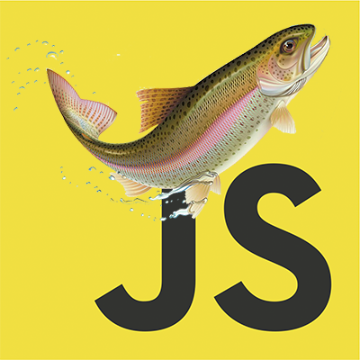

Stupid ES6 Framework
======
This is not a production ready framework... This is just my playground for ES6 features.

Usage
------
Checkout this mini under-construction application: https://github.com/canastro/MyCity

ES6 features used:
------
* Shadow DOM
* Web components
* Quasi-literal
* Object.observe (is this ES7?)
* Map and Sets
* Arrow functions
* Classes
* Promise
* Object.assign

To do list:
------
* Create a class of watchers?
